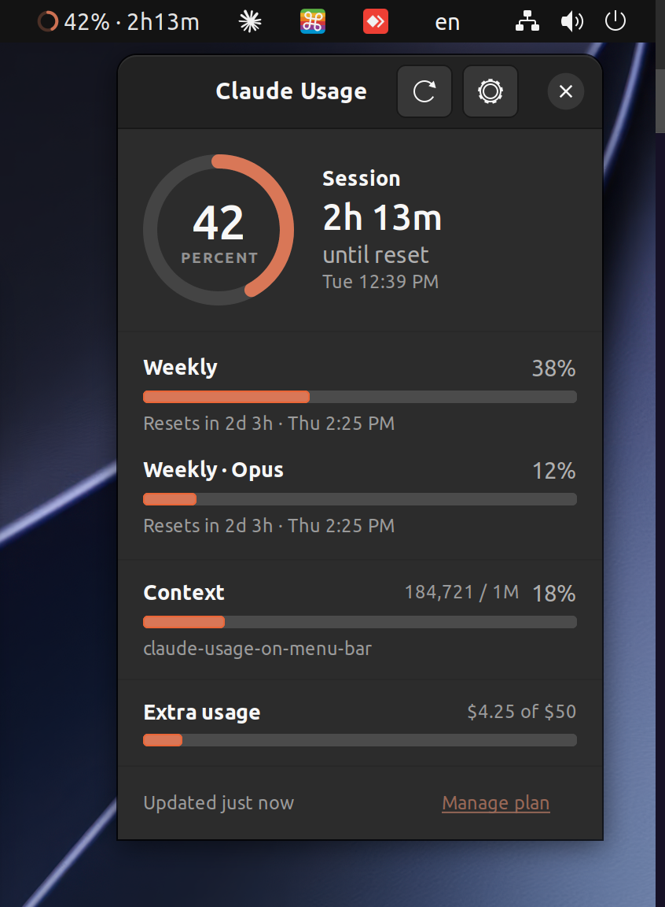
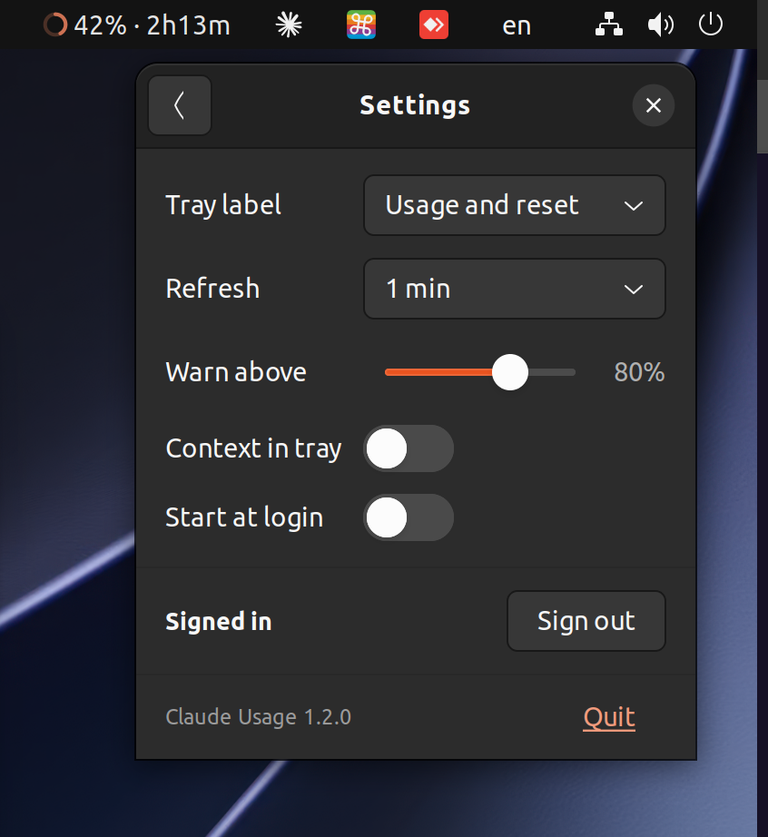

# Claude Usage

[](https://github.com/YigitSalihEmecen/claude-usage-on-menu-bar/releases/latest)
[](https://github.com/YigitSalihEmecen/claude-usage-on-menu-bar/releases)
[](https://github.com/YigitSalihEmecen/claude-usage-on-menu-bar/actions/workflows/ci.yml)
[](#macos)
[](#ubuntu-and-debian)
[](LICENSE)

See how much Claude usage you have left, right in your menu bar or system tray: no
need to open the app to check. Available for **macOS** and **Linux**.

- Your session usage and time until reset, always visible and updated every minute.
- Click for detail: weekly limits, per-model limits, and exact reset times.
- **Context window usage** for the Claude Code session you worked in most recently,
  shown in the panel and, if you turn it on in settings, in the menu bar or tray too.
  It is read from the session transcript on your computer, so it costs no extra
  network calls.
- Sign in with your browser. Already use Claude Code? One click reuses that login.
- Lives in the menu bar or tray with no windows in your way. Follows light and dark mode.

## Download

Get the build for your system from the
[**releases page**](https://github.com/YigitSalihEmecen/claude-usage-on-menu-bar/releases/latest).

| Platform | Download | Requires |
| --- | --- | --- |
| macOS | `ClaudeUsage-<version>-universal.dmg` | macOS 14 or later, Apple Silicon or Intel |
| Ubuntu, Debian | `claude-usage_<version>_all.deb` | Ubuntu 22.04 / Debian 12 or later, amd64 or arm64 |
| Other Linux | `claude-usage-linux-<version>.tar.gz` | Python 3.10+, GTK 3, AppIndicator |

Each release lists SHA-256 checksums for its files. Both platforms are built from this
repository by the same release workflow, so every version is published for both at once.

## macOS

<p align="left">
  
</p>

<p align="left">
  </svg>" />
</p>

Open the DMG and drag **Claude Usage** to your Applications folder. One build works on
both Apple Silicon and Intel Macs.

**First launch:** macOS will say the developer cannot be verified, because the app
is not signed with a paid Apple Developer account. Open **System Settings → Privacy
& Security** and click **Open Anyway**. You only need to do this once.

## Ubuntu and Debian

<p align="left">
  </svg>">
</p>

Download the `.deb` and install it with `apt`, which also installs the dependencies:

```sh
sudo apt install ./claude-usage_*_all.deb
```

Then start **Claude Usage** from your application menu. The tray shows a progress ring
with your usage and time until reset; open its menu for a summary of every limit, or
**Open Claude Usage** for the full panel.

On Ubuntu the tray icon works out of the box. Other GNOME desktops need the
[AppIndicator extension](https://extensions.gnome.org/extension/615/appindicator-support/);
KDE Plasma and most other desktops support it natively. For other distributions,
supported desktops, and troubleshooting, see the **[Linux guide](linux/README.md)**.

Requires Ubuntu 22.04 or later, or Debian 12 or later.

## Signing in

Open the panel, then choose **Sign in with browser**. If that does not work, use
**Browser did not open?** to paste a code instead, or **Use my Claude Code login**
to reuse the login already on your computer.

Your login is stored in your Mac's keychain, or on Linux in your desktop keyring, and
never leaves your computer except to talk to Anthropic.

The sign-in screen says *Claude Code*, because Anthropic does not offer a public
sign-in for third-party apps and the app reuses Claude Code's.

## Build it yourself

The repository holds both apps side by side: [`macos/`](macos) is a Swift package and
[`linux/`](linux) is a Python package. Clone it once for either.

**macOS** needs macOS 14+ and Xcode or the Command Line Tools:

```sh
git clone https://github.com/YigitSalihEmecen/claude-usage-on-menu-bar.git
cd claude-usage-on-menu-bar/macos
Scripts/build.sh
open "build/Claude Usage.app"
```

**Linux** needs Python 3.10+ and the GTK and tray libraries the `.deb` depends on:

```sh
git clone https://github.com/YigitSalihEmecen/claude-usage-on-menu-bar.git
cd claude-usage-on-menu-bar/linux
make run          # run from the checkout
make deb          # build dist/claude-usage_<version>_all.deb
```

`Scripts/test.sh` (macOS) and `make test` (Linux) run the tests, and `Scripts/package.sh`
builds the DMG. See [CONTRIBUTING.md](CONTRIBUTING.md) for how the project is laid out.

## Notes

This is an unofficial app. It reads the same usage data Claude Code shows, from an
endpoint Anthropic has not documented, so the numbers may occasionally be wrong or
stop working if Anthropic changes it.

Not affiliated with or endorsed by Anthropic. [MIT licensed](LICENSE).

## Credits

Context window usage was contributed by [Ali Kömürcü](https://github.com/alikomurcu)
in [#1](https://github.com/YigitSalihEmecen/claude-usage-on-menu-bar/pull/1).
